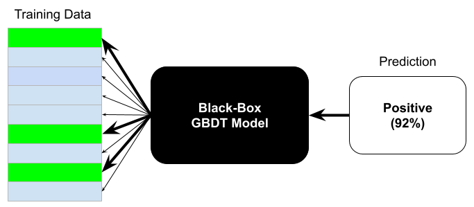

TreeInfluence: Influence Estimation for Gradient-Boosted Decision Trees
---
[](https://pypi.org/project/tree_influence/)
[](https://pypi.org/project/tree_influence/)
[](https://github.com/jjbrophy47/tree_influence/blob/master/LICENSE)
[](https://github.com/jjbrophy47/tree_influence/actions/workflows/wheels.yml)

**tree_influence** is a python library that implements influence estimation for gradient-boosted decision trees (GBDTs), adapting popular techniques such as TracIn and Influence Functions to GBDTs. This library is compatible with all major GBDT frameworks including LightGBM, XGBoost, CatBoost, and SKLearn.

<p align="center">
	
</p>

Installation
---
1. Install Python 3.9.6+.
2. Run `make all`.

<!--```shell
pip install tree_influence
```-->

Usage
---
Simple example using *BoostIn* to identify the most influential training instances to a given test instance:

```python
import numpy as np
from sklearn.datasets import load_iris
from sklearn.model_selection import train_test_split
from lightgbm import LGBMClassifier
from tree_influence.explainers import BoostIn

# load iris data
data = load_iris()
X, y = data['data'], data['target']

# use two classes, then split into train and test
idxs = np.where(y != 2)[0]
X, y = X[idxs], y[idxs]
X_train, X_test, y_train, y_test = train_test_split(X, y, test_size=0.1, random_state=1)

# train GBDT model
model = LGBMClassifier().fit(X_train, y_train)

# fit influence estimator
explainer = BoostIn().fit(model, X_train, y_train)

# estimate training influences on each test instance
influence = explainer.get_local_influence(X_test, y_test)  # shape=(no. train, no. test)

# extract influence values for the first test instance
values = influence[:, 0]  # shape=(no. train,)

# sort training examples from:
# - most positively influential (decreases loss of the test instance the most), to
# - most negatively influential (increases loss of the test instance the most)
training_idxs = np.argsort(values)[::-1]
```

Supported Estimators
---
**tree_influence** supports the following influence-estimation techniques in GBDTs:

| Method | Description |
| -------| ----------- |
| BoostIn | Traces the influence of a training instance throughout the training process (adaptation of TracIn). |
| TREX | Trains a surrogate kernel model that approximates the original model and decomposes any prediction into a weighted sum of the training examples (adaptation of representer-point methods). |
| LeafInfluence | Estimates the impact of a training example on the *final* GBDT model (adaptation of influence functions). |
| TreeSim | Computes influence via similarity in tree-kernel space. |
| LOO | Leave-one-out retraining, measures the influence of a training instance by removing and retraining without that instance.

License
---
[Apache License 2.0](https://github.com/jjbrophy47/tree_influence/blob/master/LICENSE).

<!--Reference
---
Brophy, Hammoudeh, and Lowd. [Adapting and Evaluating Influence-Estimation Methods for Gradient-Boosted Decision Trees](). arXiv 2022.

```
```-->